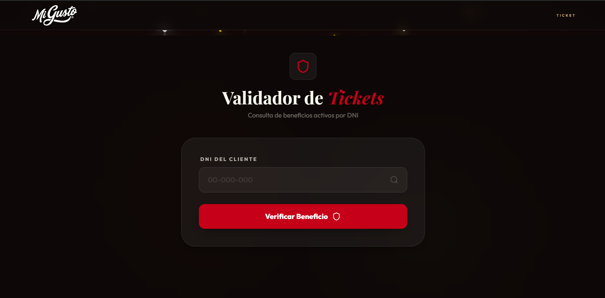

# Golden Tickets · Mi Gusto Lovers

Sistema web para gestionar la experiencia **Golden Tickets** de Mi Gusto.
Validación de cupones físicos, registro de ganadores, control de beneficios mensuales y canjes en sucursal, todo integrado con **Supabase** como backend-as-a-service.

Mi Gusto Golden Tickets es una campaña de marketing en la que se dejan, de forma aleatoria en packs de 6 o 12 empanadas, tickets especiales con un ID único y un código QR que redirige a esta web. Cada ticket otorga como premio un pack de **12 empanadas gratis cada mes** durante:
- **12 meses** para el **Ticket Gold**
- **6 meses** para el **Ticket Silver**
- **3 meses** para el **Ticket Bronze**

La aplicación está pensada para:

- **Clientes**: validar su ticket y registrarse para obtener su beneficio.
- **Sucursal / Staff**: validar tickets en el local, registrar titulares y controlar canjes mensuales por DNI.

---

## Paginas
- **`/` – Landing base y canje de cupón**
  - Selección de nivel de premio: **Oro**, **Plata**, **Bronce**.
  - Validación de ticket por ID (formato `MGXXXXXXXX`) contra Supabase (`tickets`).
  - Verificación de:
    - Existencia del ticket.
    - Que no esté usado.
    - Que el tipo coincida con el nivel seleccionado.
  - Registro del ganador (nombre, email, teléfono, DNI) en Supabase (`registros`) y marcado del ticket como usado.
  - Secciones informativas: pasos de la experiencia, FAQs, términos y condiciones, ubicación de la sucursal.

- **`/validacion` – Validación de beneficio por DNI**
  - Pensado para uso en la sucursal.
  - Se ingresa solo el **DNI**:
    - Busca un registro activo en `registros`.
    - Obtiene el ticket asociado (`tickets`) y calcula fecha de vencimiento según meses de vigencia.
    - Consulta `canjes` para verificar si ya se canjeó un beneficio en el mes actual.
  - Muestra:
    - Tipo de ticket (Bronce / Plata / Oro).
    - Meses de vigencia y fecha de registro.
    - Estado: **vigente / vencido**, **con o sin canje este mes**.
  - Permite **registrar un canje** (inserta un registro en `canjes`).

---

## Licencia

Todo el proyecto se encuentra bajo los derechos de **Mi Gusto** © 2026.
Queda prohibida su reproducción total o parcial sin autorización expresa de la empresa.

