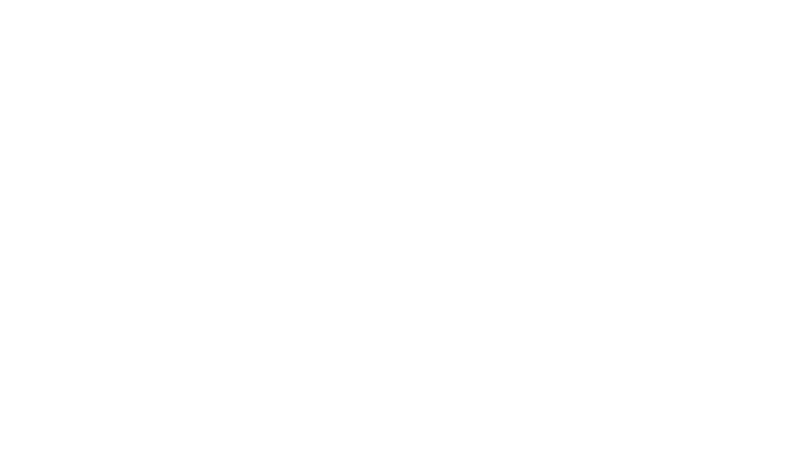
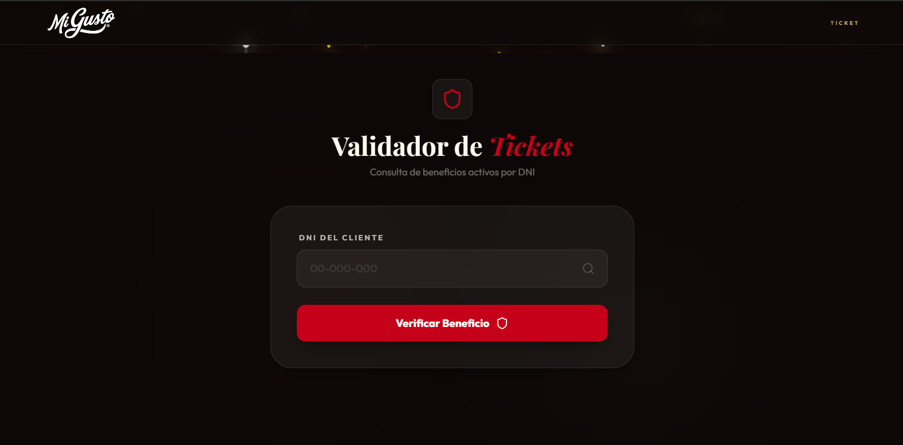
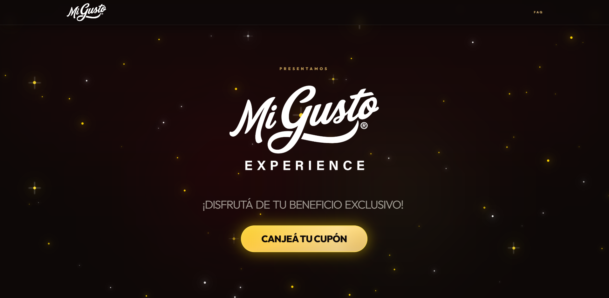
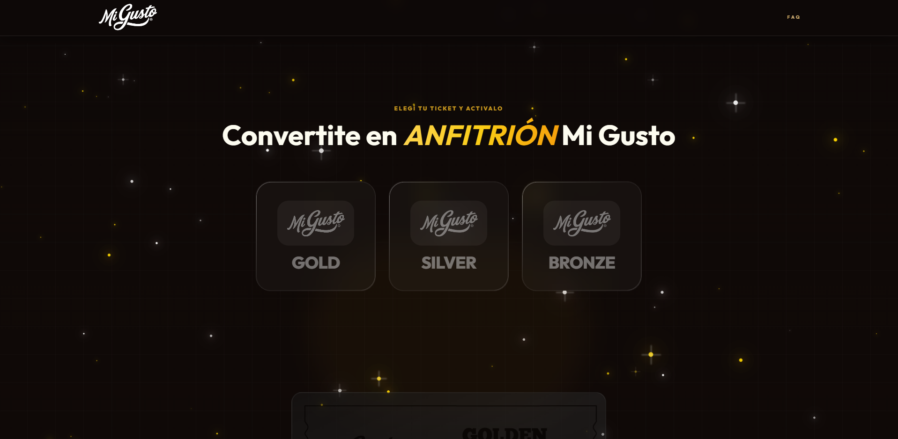
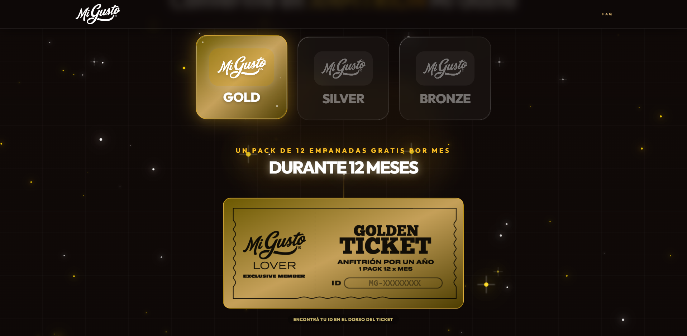
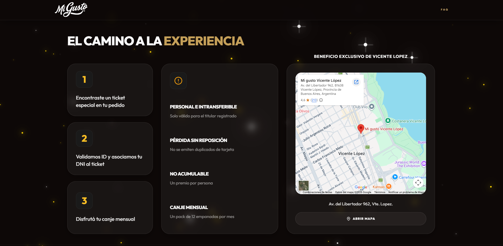
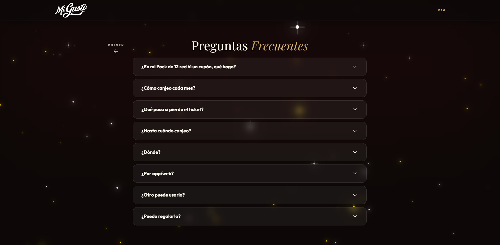

  

  # 🎫 Golden Tickets · Mi Gusto Experience

  *Sistema exclusivo de validación de cupones, registro de ganadores y gestión de beneficios mensuales.*

   

  
  
  
  
  

---

## 🌟 Sobre la Experiencia Golden Tickets

**Mi Gusto Golden Tickets** es una campaña promocional exclusiva de **Mi Gusto**. Dentro de los packs de 6 y 12 empanadas se distribuirán, de forma aleatoria, tickets especiales con un ID único y un código QR que redirige a esta plataforma.

Cada ticket premia al ganador con un **pack de 12 empanadas gratis al mes** durante el período de vigencia de su membresía:

| Categoría | Beneficio Exclusivo | Duración |
| :---: | :--- | :---: |
| 🥇 **Ticket Gold** | **1 Pack de 12 empanadas gratis** por mes | **12 Meses** |
| 🥈 **Ticket Silver** | **1 Pack de 12 empanadas gratis** por mes | **6 Meses** |
| 🥉 **Ticket Bronze** | **1 Pack de 12 empanadas gratis** por mes | **3 Meses** |

---

## 🚀 Funcionalidades Principales

### 📱 `/` – Landing Base & Canje de Cupón
Diseñada para que los clientes interactúen, validen su código y activen su beneficio.
- **Selección de Nivel**: Elección entre membresías **Gold**, **Silver** y **Bronze**.
- **Validación en Tiempo Real**: Verificación del código `MGXXXXXXXX` contra la base de datos centralizada en Supabase.
- **Registro Seguro**: Asociación de datos personales (Nombre, Email, Teléfono, DNI) al ticket activado.
- **Información Transparente**: Secciones informativas con guía paso a paso, mapa interactivo de la sucursal y FAQ.

 

  

 

### 🛡️ `/validacion` – Panel de Control y Validador por DNI
Herramienta interna optimizada para el uso del personal en sucursal.
- **Búsqueda por DNI**: Identificación rápida del titular y verificación del ticket asociado.
- **Control de Vencimiento**: Cálculo de vigencia y comprobación de canjes ya realizados en el mes en curso.
- **Registro Instantáneo**: Confirmación y guardado de canje mensual con un solo clic.

 

  

---

## 📸 Galería de Imágenes

  <!-- Línea 1: 2x2 (Primera Fila) -->
  

    
    
  

  <!-- Línea 2: 2x2 (Segunda Fila) -->
  

    
    
  

  <!-- Línea 3: Una sola imagen -->
  

    
  

---

## 🔒 Licencia & Propiedad Intelectual

Todo el desarrollo, diseño y contenido se encuentran bajo los derechos exclusivos de **Mi Gusto** © 2026.  
*Queda prohibida su reproducción total o parcial sin autorización previa de la empresa.*

